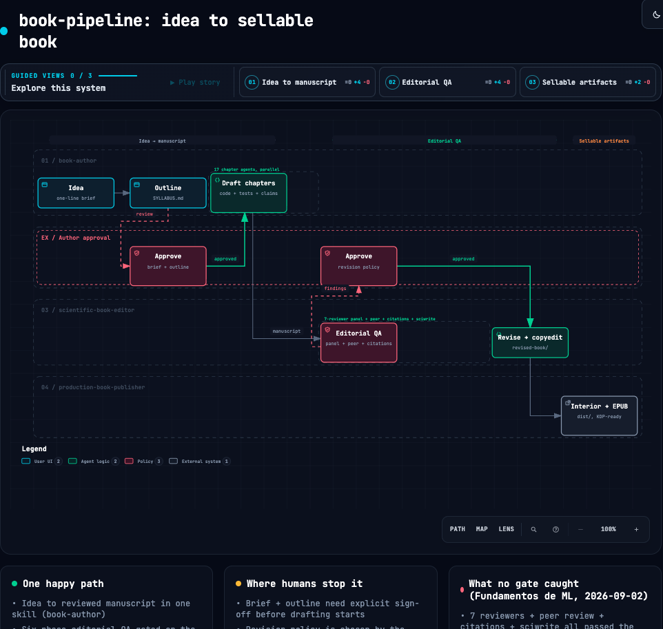

# book-pipeline

A repeatable, three-command system for producing professional technical books
with Claude Code — from idea to upload-ready KDP files. Built and validated
end-to-end on three books: a 200-page technical book, a from-scratch demo
that went idea → validated EPUB + print PDFs in one session, and a full
Spanish-language ML textbook (14 chapters, 427 tests, 174 verifiable claims)
that also caught this pipeline's first real failure mode — see
[Lessons from a real failure](#lessons-from-a-real-failure-2026-09-02) below.

```
/book-author "a book about X"                → book/ + SYLLABUS.md + METADATA.md
/scientific-book-editor ./book/              → 4 review reports + publishability
                                               verdict + revised-book/  (gated)
/production-book-publisher ./revised-book/   → dist/{ebook, paperback,
                                               hardcover, validation}
```

## How a book moves through it



Static screenshot above (no motion — GitHub can't run the viewer's JS/CSS
that drives it). Open
**[`docs/diagrams/book-pipeline.html`](docs/diagrams/book-pipeline.html)**
locally for the real thing: trace animation, dark/light, and three guided
views (manuscript → editorial QA → production). Built with
[archify](https://github.com/tt-a1i/archify) from
[`docs/diagrams/book-pipeline.workflow.json`](docs/diagrams/book-pipeline.workflow.json)
— see `docs/diagrams.md` for how to regenerate or extend it.

## What it installs

Three **orchestrator skills** (this repo's own, in `skills/`) on top of ~18
community skills and ~24 agents from 11 public repos at pinned SHAs
(`vendors.lock`). **9 of those 11 are vendored into `vendor/` in this repo**
— `install.sh` copies them locally, no network call needed. The remaining 2
(`sciwrite`, `kindle-cover`) have no clear upstream redistribution license,
so they're cloned fresh from GitHub at their pinned SHA on every install
instead — see [`vendor/NOTICE.md`](vendor/NOTICE.md) for the license of every
single dependency and the reasoning behind the split.

| Layer | Skills | Source | Self-contained? |
|---|---|---|---|
| **Authoring** (Phase 0) | textbook-methodology, notebook-paired-with-prose, cross-reference-discipline, manuscript-drafting, lit-review, humanizer + 11 bookwright agents | claude-anvil (bookwright), research-skills | ✅ vendored |
| **Editorial** (steps 1–6) | 12 academic reviewer agents, paper-review, citation-audit*, sciwrite, manuscript-revision*, line-and-copy-editor | academic-writing-agents, research-skills, academic-human-in-the-loop, sciwrite, manuscript-writing, claude-skills | 5 of 6 vendored; **sciwrite live-clones** |
| **Production** (steps 7–11) | book-typesetting, kindle-book, kindle-cover, kdp-audit, kdp-listing, ebook-publishing | book-typesetting-skill, kindle-\*-skill, claude-anvil (kdp), ebook-publishing-skill | 5 of 6 vendored; **kindle-cover live-clones** (+ a local patch, see below) |

\* adapted at install: citation-audit is rewired from the OpenAI Codex MCP to
fresh Claude subagents (see `patches/citation-audit-adaptation.md`), and the
two colliding `manuscript-writing` skills are renamed `manuscript-drafting`
(authoring lens) and `manuscript-revision` (editing lens). kindle-cover gets
a local patch adding 7×10in trim (upstream only ships 5×8/5.5×8.5/6×9/8.5×11
— see `patches/kindle-cover-trim-7x10.md`, applied automatically and
idempotently). The KDP skills get their plugin docs bundled and
path-rewritten. `kdp-publish`'s cover MCP (OpenAI API) is deliberately NOT
installed.

**Not installed by `install.sh` at all:** `scientific-manuscript-review` (a
different installer mechanism — the [skills.sh](https://skills.sh)
marketplace, not a git clone — and no upstream license either). It caught a
real book-wide problem the standard pipeline missed; see
`docs/optional-skills.md` for what it's for and how to add it by hand.

## Install

```bash
git clone <this-repo> && cd book-pipeline
./install.sh --check     # doctor only: see what tooling is missing
./install.sh             # idempotent; --force overwrites existing skills
```

9 of 11 dependencies come from `vendor/` in this repo — no network needed for
those. Only `sciwrite` and `kindle-cover` clone from GitHub at install time.

Requirements the installer checks but does NOT auto-install (large installers):
**Quarto** (quarto.org) and **TeX Live / MacTeX** (xelatex). Brew-installable
requirements: pandoc, ghostscript, epubcheck (plus poppler + imagemagick
recommended). A Python venv with the production helpers (reportlab, Pillow,
pypdf, fonttools, pytest, pydantic) is created at
`~/.claude/venvs/book-pipeline`.

Everything lands in `~/.claude/` (override with `CLAUDE_DIR=... ./install.sh`
— also how you smoke-test the installer without touching your real setup).
Restart Claude Code sessions after installing so the skills register.

## The workflow

See `docs/WORKFLOW.md` for the full stage-by-stage graph with gates, or the
diagram above for the compressed version. The short version: **book-author**
takes an idea through brief (gate) → verified sources → outline (gate) →
drafted chapters with *executable-chapter* discipline (every printed number
generated by shipped, pytest-pinned code, tracked claim-by-claim in
`passport.yaml`) → multi-auditor review → de-AI pass → metadata + the ISBN
decision. **scientific-book-editor** runs a 7-reviewer editorial panel — the
classic 5 plus an adversarial **skeptic/advocate pair** (verdict: PUBLISH /
MINOR / MAJOR / DON'T), independent peer review, a primary-source citation
audit, and sciwrite; then — after you approve the findings — applies them to
a copy and copy-edits it. **production-book-publisher** builds print
interiors (Quarto/LaTeX), a validated EPUB3, wrap covers with computed spine,
and runs preflight + a KDP compliance audit before handing you distribution
checklists.

Design principles baked into the orchestrators (each earned on a real book):

- **Executable chapters**: prose can't drift from arithmetic — reviewers verify
  instead of trusting.
- **The claim ledger (`passport.yaml`)**: pytest pins protect tables; every
  prose sentence asserting a specific number gets its own tracked claim
  (id, check, expected value, PASS/FAIL/STALE), so drift in a claim *not*
  backed by a table is still catchable — extends pytest pinning into prose.
- **Adversarial review pair**: a skeptic hunts for exactly the finding that
  makes the other five reviewers look complacent; an advocate defends
  deliberate authorial choices from being "corrected" into a plainer,
  worse-uniform voice. Both run every editorial pass, not just on request.
- **Verify-then-edit**: when prose contradicts a printed number, run the code
  to decide which side is wrong (the ACM "Results Reproduced" idea).
- **Fresh-context review convergence**: independent reviewers over the same
  text; findings that converge are real.
- **Gates are the user's**: brief, outline, publishability verdict, and
  revision policy are explicit approval points.
- **Never fabricate**: unknown bibliographic details stay marked unverified;
  missing ISBNs are reported absent, never placeholder-filled.
- **Quarto crossref labels** (`#tbl-* / #sec-* / #eq-*`) from the outline
  onward — production resolves them natively in PDF and EPUB.

`docs/community-validation.md` maps each homegrown practice to its
community-validated equivalent (nbval, artifact evaluation, Paged.js, …) with
adoption evidence — the `passport.yaml` ledger and the skeptic/advocate pair
above are exactly the two upgrades that research turned up.

## Diagrams

Two different tools for two different jobs — see `docs/diagrams.md` for the
full split:

- **[archify](https://github.com/tt-a1i/archify)** diagrams *this repo* — the
  pipeline diagram at the top of this README is one. Not part of the book
  pipeline itself; it documents the pipeline.
- **[diagram-design](https://github.com/cathrynlavery/diagram-design)** is
  for *conceptual figures inside a book chapter* — an architecture map, an
  algorithm's five stages, anything with no computed data behind it. Any
  figure that plots real computed values (loss curves, decision boundaries,
  actual data) stays in matplotlib, generated by the chapter's own
  `code/chNN/` module — that's what `notebook-paired-with-prose` and the
  claim ledger protect, and a templated diagram tool would break the "every
  number comes from executed code" guarantee. `book-author`'s `SKILL.md`
  states this split explicitly so drafting agents don't blur it.

## Lessons from a real failure (2026-09-02)

Producing *Fundamentos de Machine Learning* (Spanish, 14 chapters) went
through every gate above cleanly — 7-reviewer panel, peer review, citation
audit, sciwrite, all passed. The author read the finished book and called it
unreadable: a set of invented pedagogical terms ("capsule", "napkin-math",
"the five-step ritual") repeated identically, word-for-word, in 13 of 14
chapters. Every reviewer above had approved it, because every reviewer
worked in chapter-shards — the defect only existed *accumulated*, across
76,000 words read start to finish, which is exactly what none of the
automated gates do.

Fixed with 9 parallel agents rewriting the prose voice (technical content,
code, and test-pinned numbers untouched — verified independently after), then
re-running production. No pipeline change fixes this class of failure by
itself; `docs/optional-skills.md` documents `scientific-manuscript-review` as
the closest thing to a mitigation (a deep, whole-manuscript read), and the
honest fix is still: before calling a book done, someone reads it.

## Licenses

Vendored repos in `vendor/` keep their own permissive license (MIT /
BSD-3-Clause), reproduced verbatim per dependency — see `vendor/NOTICE.md`
for the full table and which 2 dependencies are deliberately *not* vendored
here over an unclear license. The three orchestrator skills in `skills/` are
yours.
