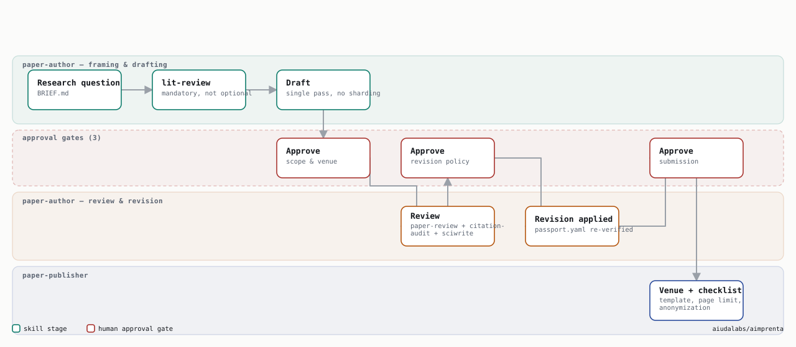
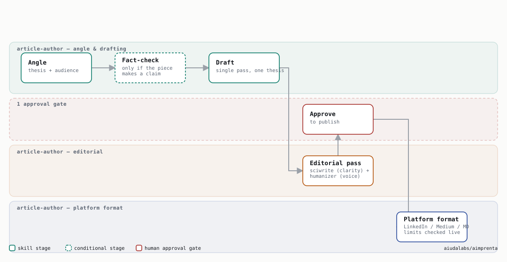

**[aiudalabs.github.io/aimprenta →](https://aiudalabs.github.io/aimprenta/)**

A repeatable system for producing **technical and scientific nonfiction**
with Claude Code — from idea to upload-ready KDP files, a submission-ready
paper, or a publish-ready short-form article. Not for fiction: the core of
the system is a claim ledger that checks every prose number against code
that actually runs, plus an editorial panel modeled on academic peer review
(citation audits against primary sources, a math auditor, a Sainani-style
writing-clarity pass). A novel has no such claims to verify — this tool
doesn't help you write one.

The flagship, three-command pipeline is for books:

```
/book-author "a book about X"                → book/ + SYLLABUS.md + METADATA.md
/scientific-book-editor ./book/              → 5 review reports + publishability
                                               verdict + revised-book/  (gated)
/production-book-publisher ./revised-book/   → dist/{ebook, paperback,
                                               hardcover, validation}
```

The same authoring and editorial skill layer also powers two lighter
pipelines for shorter work — a single paper (`/paper-author` +
`/paper-publisher`) and a short-form article (`/article-author`) — see
[Papers and short-form articles](#papers-and-short-form-articles) below.


An idea moves through `book-author`, waits at two human approval gates,
gets a 7-reviewer editorial pass in `scientific-book-editor`, and comes out
as a shippable interior + EPUB from `production-book-publisher`. The dashed
edges and the traveling marker are live CSS/SMIL animation — plain SVG, no
JS, so it plays inline right here on GitHub. Source:
[`aimprenta-pipeline-animated.svg`](docs/diagrams/aimprenta-pipeline-animated.svg).

## Install

Three steps. You `cd` into the clone to *run* the installer, but everything
it writes goes to `~/.claude/` (global) — not into this folder — so the clone
itself is disposable once install.sh finishes. Then go work in your actual
book's folder.

```bash
# 1. Install the skills — one time, from wherever you clone this repo.
#    install.sh writes to ~/.claude/, not to this directory, so it doesn't
#    matter where you keep the clone afterward.
git clone https://github.com/aiudalabs/aimprenta.git && cd aimprenta
./install.sh --check     # doctor only: see what tooling is missing
./install.sh             # idempotent; --force overwrites existing skills

# 2. Go to (or create) the folder where your book will actually live —
#    NOT inside the aimprenta clone.
mkdir ~/my-book && cd ~/my-book

# 3. Open Claude Code in that folder, then run the slash commands below.
```

9 of 11 dependencies come from `vendor/` in this repo — no network needed for
those. Only `sciwrite` and `kindle-cover` clone from GitHub at install time
(see [What it installs](#what-it-installs) for why).

Requirements the installer checks but does NOT auto-install (large installers):
**Quarto** (quarto.org) and **TeX Live / MacTeX** (xelatex). Brew-installable
requirements: pandoc, ghostscript, epubcheck (plus poppler + imagemagick
recommended). A Python venv with the production helpers (reportlab, Pillow,
pypdf, fonttools, pytest, pydantic) is created at
`~/.claude/venvs/aimprenta`.

Everything lands in `~/.claude/` (override with `CLAUDE_DIR=... ./install.sh`
— also how you smoke-test the installer without touching your real setup).
Restart Claude Code sessions after installing so the skills register.

## Using it

Each command is a Claude Code skill; run it as a slash command inside a
session.

1. **`/book-author "<one-line idea>"`** — interviews you briefly, then takes
   the idea through brief (gate) → verified sources → outline (gate) →
   drafted chapters with *executable-chapter* discipline (every printed
   number generated by shipped, pytest-pinned code, tracked claim-by-claim in
   `passport.yaml`) → multi-auditor self-review → a de-AI pass → metadata +
   the ISBN decision. Output: `book/*.md`, `code/chNN/`, `SYLLABUS.md`,
   `METADATA.md`.
2. **`/scientific-book-editor ./book/`** — runs a 7-reviewer editorial panel
   (the classic 5 — logic, technical, consistency, writing, bibliography —
   plus an adversarial **skeptic/advocate pair**), independent peer review,
   a primary-source citation audit, and a 5-pass sciwrite clarity review.
   Presents the consolidated findings and a publishability verdict
   (PUBLISH / MINOR / MAJOR / DON'T) and **waits for you to approve which
   findings to apply** before touching anything. Only then copies the book to
   `revised-book/`, applies the approved fixes, runs a final copyedit pass,
   and finishes with a **mandatory whole-manuscript coherence read** — one
   continuous read of the entire book, not chapter-sharded like every phase
   before it, specifically hunting for defects that only exist accumulated
   across the whole manuscript (repeated house terminology, template
   fatigue, voice drift) that no per-chapter reviewer can see by
   construction. Output: 5 report files under `editorial/`,
   `revised-book/*.md`.
3. **`/production-book-publisher ./revised-book/`** — builds a print interior
   (Quarto/LaTeX), a validated EPUB3, wrap covers with a computed spine
   width, runs PDF preflight and a KDP compliance audit, and produces
   per-platform distribution checklists. Output: `dist/{ebook, paperback,
   hardcover, validation}/`.

Read `docs/WORKFLOW.md` for the full stage-by-stage graph with every gate.

Design principles behind the three book orchestrators, each earned on a real book:

- **Executable chapters**: prose can't drift from arithmetic — reviewers
  verify instead of trusting.
- **The claim ledger (`passport.yaml`)**: pytest pins protect tables; every
  prose sentence asserting a specific number gets its own tracked claim
  (id, check, expected value, PASS/FAIL/STALE), extending pytest pinning into
  prose, not just tables.
- **Adversarial review pair**: a skeptic hunts for the finding that makes the
  other five reviewers look complacent; an advocate defends deliberate
  authorial choices from being "corrected" into a flatter, worse voice. Both
  run on every editorial pass, not just on request.
- **Verify-then-edit**: when prose contradicts a printed number, run the code
  to decide which side is wrong (the ACM "Results Reproduced" idea).
- **Fresh-context review convergence**: independent reviewers over the same
  text; findings that converge across reviewers are the real ones.
- **Gates are the user's**: brief, outline, publishability verdict, and
  revision policy are explicit approval points — nothing gets applied
  without a yes.
- **Never fabricate**: unknown bibliographic details stay marked unverified;
  missing ISBNs are reported absent, never placeholder-filled.
- **Quarto crossref labels** (`#tbl-* / #sec-* / #eq-*`) from the outline
  onward — production resolves them natively in both PDF and EPUB.
- **A whole-book read is mandatory, not optional**: every review phase
  shards by chapter — correct for what those phases check, but structurally
  blind to a defect that only exists accumulated across the whole
  manuscript. `scientific-book-editor` Phase 7 is the one pass whose scope
  is the entire book, on purpose, before it becomes canonical.
- **Automated checks don't see the page**: `pdfinfo`, page counts, and
  `epubcheck` can all pass while the interior is wrong — they never render
  anything. `production-book-publisher` Step 10 requires actually viewing
  rasterized sample pages (front matter, a math/figure/table page, and
  pages spread across the book cross-checked against expected chapter
  topics) before a build is called done.
- **Deterministic gates alongside LLM judgment, not instead of it**:
  `scripts/check_structure.py` and `scripts/check_readability.py` (zero
  network, zero model call) catch truncation markers, empty sections, and
  readability outliers before Phase 1 spends any review budget — mechanical
  checks a confident-sounding chapter can't talk a reviewer out of.
- **STALE is enforced, not a convention**: `scripts/check_claims.py`
  re-runs every chapter's test suite against its `passport.yaml` and reports
  disagreements — cross-referenced against `KNOWN-ISSUES.md` so a documented
  environment-version pin isn't mistaken for real drift. It has already
  caught a real regression: a prose edit changed a pasted table's wording
  without updating the code that generates it, silently breaking the
  verbatim-pin contract.
- **The time/cost commitment is stated, not discovered mid-run**:
  `book-author` gives an honest order-of-magnitude estimate at the brief
  gate and a sharper one at the outline gate, once chapter count is known —
  agent-dispatch count and expected wall-clock time, not a hedge.

`docs/community-validation.md` maps each of these practices to its
community-validated equivalent (nbval, artifact evaluation, Paged.js, …) with
adoption evidence.

## Papers and short-form articles

Two lighter pipelines reuse the same authoring and editorial skill layer as
the book pipeline, scaled to a single document instead of a multi-chapter
manuscript. Neither shards by chapter or section — a paper or an article
fits in one context, so the orchestration is simpler than the book pipeline
on purpose, not a stripped-down copy of it.

**A paper** (journal article, conference paper, preprint):

```
/paper-author "a research question"   → manuscript.md + references.bib
                                        + review-report.md  (3 gates)
/paper-publisher <paper-dir>          → submission/{paper.pdf, validation/}
```



`paper-author` makes literature grounding mandatory (never optional, unlike
a book), drafts in one pass following the same Introduction-Arc / IMRaD
structure `paper-review` checks against, and runs `paper-review` +
`citation-audit` + `sciwrite` as a single non-sharded review — the
per-chapter Scale rule from `scientific-book-editor` doesn't apply at this
length. `paper-publisher` applies the target venue's template (an
arXiv-style default that needs no fetch, or a named venue's own class
fetched live at production time — venue templates are never vendored, see
`skills/paper-publisher/references/venue-templates.md`, for the same
license-caution reason `sciwrite` and `kindle-cover` are live-cloned) and
runs a submission-readiness checklist (page limit, anonymization if
double-blind, bibliography style, reproducibility).

**A short-form article** (LinkedIn, Medium, a newsletter, or a plain
markdown blog post):

```
/article-author "an angle"   → article.md + formatted/{platform}.md
                               + platform-checklist.md  (1 gate)
```



One command, not three — a 600–2000 word piece doesn't need book-author's
ceremony. Fact-checking is conditional, not a fixed phase: it runs only when
the piece makes a verifiable claim, so an opinion piece isn't forced through
a citation audit it doesn't need. Platform formatting rules (character
limits, hashtag conventions, image specs) are checked live via WebSearch at
production time rather than hardcoded, since they change and a stale
remembered number is worse than a fresh lookup.

## What it installs

Six **orchestrator skills** (this repo's own, in `skills/` — the 3 for books
plus `paper-author`, `paper-publisher`, `article-author`) on top of ~18
community skills and ~24 agents from 11 public repos at pinned SHAs
(`vendors.lock`). The paper and article orchestrators install no additional
dependencies beyond what the book pipeline already needs — they call the
same `lit-review`, `citation-audit`, `sciwrite`, `humanizer`, `paper-review`,
and `manuscript-revision` skills at a smaller scale. **9 of those 11 are vendored into `vendor/` in this repo**
— `install.sh` copies them locally, no network call needed. The remaining 2
(`sciwrite`, `kindle-cover`) have no clear upstream redistribution license,
so they're cloned fresh from GitHub at their pinned SHA on every install
instead — see [`vendor/NOTICE.md`](vendor/NOTICE.md) for the license of every
single dependency and the reasoning behind the split.

| Layer | Skills | Source | Self-contained? |
|---|---|---|---|
| **Authoring** (Phase 0) | textbook-methodology, notebook-paired-with-prose, cross-reference-discipline, manuscript-drafting, lit-review, humanizer + 11 bookwright agents | claude-anvil (bookwright), research-skills | ✅ vendored |
| **Editorial** (steps 1–7) | 12 academic reviewer agents, paper-review, citation-audit*, sciwrite, manuscript-revision*, line-and-copy-editor | academic-writing-agents, research-skills, academic-human-in-the-loop, sciwrite, manuscript-writing, claude-skills | 5 of 6 vendored; **sciwrite live-clones** |
| **Production** (steps 7–11) | book-typesetting, kindle-book, kindle-cover, kdp-audit, kdp-listing, ebook-publishing | book-typesetting-skill, kindle-\*-skill, claude-anvil (kdp), ebook-publishing-skill | 5 of 6 vendored; **kindle-cover live-clones** (+ a local patch, see below) |

\* adapted at install: citation-audit is rewired from the OpenAI Codex MCP to
fresh Claude subagents (see `patches/citation-audit-adaptation.md`), and the
two colliding `manuscript-writing` skills are renamed `manuscript-drafting`
(authoring lens) and `manuscript-revision` (editing lens). kindle-cover gets
a local patch adding 7×10in trim (upstream only ships 5×8/5.5×8.5/6×9/8.5×11
— see `patches/kindle-cover-trim-7x10.md`, applied automatically and
idempotently). The KDP skills get their plugin docs bundled and
path-rewritten. `kdp-publish`'s cover MCP (OpenAI API) is deliberately NOT
installed.

**Not installed by `install.sh` at all:** `scientific-manuscript-review` — a
different installer mechanism (the [skills.sh](https://skills.sh)
marketplace, not a git clone) with no upstream license either. See
`docs/optional-skills.md` for what it's for and how to add it by hand.

## In-book diagrams

Chapters need two different kinds of figure, produced two different ways:

- **Data-driven** (loss curves, decision boundaries, a scatter of real data)
  stay in matplotlib, generated by the chapter's own `code/chNN/` module per
  `notebook-paired-with-prose` — every printed number traces to executed
  code, pinned by a test. This is not optional; it's the guarantee the whole
  claim-ledger system depends on.
- **Conceptual** (an architecture map, a flowchart of an algorithm's stages,
  anything with no data behind it) — use the
  [diagram-design](https://github.com/cathrynlavery/diagram-design) plugin
  instead of hand-rolling it in matplotlib. Install:
  ```bash
  claude plugin marketplace add cathrynlavery/diagram-design
  claude plugin install diagram-design@diagram-design
  ```
  39 layout types, static HTML+SVG, no build step, can match a brand palette
  from a URL. `skills/book-author/SKILL.md` states this split explicitly so
  drafting agents don't blur it.

## License

The original content of this repository — the six orchestrator skills in
`skills/`, `install.sh`, `scripts/`, `patches/`, `docs/` — is MIT licensed,
see [`LICENSE`](LICENSE). Code vendored under `vendor/` keeps each
dependency's own permissive license (MIT / BSD-3-Clause), reproduced verbatim
per dependency in [`vendor/NOTICE.md`](vendor/NOTICE.md), which also lists
the 2 dependencies deliberately not vendored here over an unclear license.
