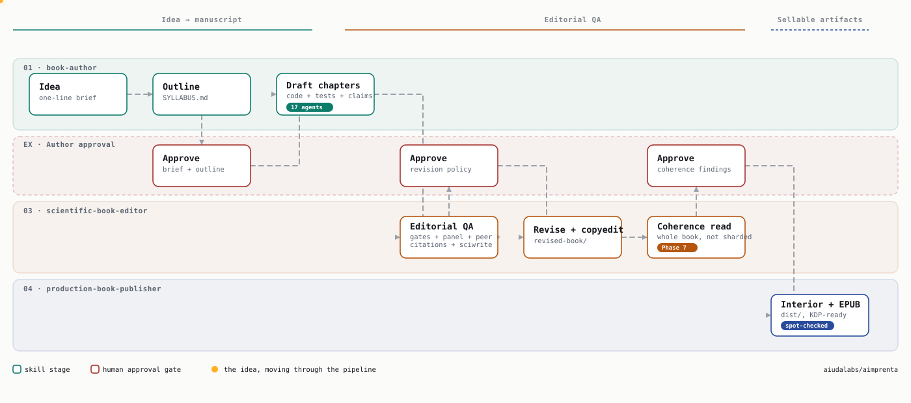

A repeatable, three-command system for producing professional technical books
with Claude Code — from idea to upload-ready KDP files.

```
/book-author "a book about X"                → book/ + SYLLABUS.md + METADATA.md
/scientific-book-editor ./book/              → 4 review reports + publishability
                                               verdict + revised-book/  (gated)
/production-book-publisher ./revised-book/   → dist/{ebook, paperback,
                                               hardcover, validation}
```



An idea moves through `book-author`, waits at two human approval gates,
gets a 7-reviewer editorial pass in `scientific-book-editor`, and comes out
as a shippable interior + EPUB from `production-book-publisher`. The dashed
edges and the traveling marker are live CSS/SMIL animation — plain SVG, no
JS, so it plays inline right here on GitHub. Source:
[`aimprenta-pipeline-animated.svg`](docs/diagrams/aimprenta-pipeline-animated.svg).

## Install

```bash
git clone https://github.com/aiudalabs/aimprenta.git && cd aimprenta
./install.sh --check     # doctor only: see what tooling is missing
./install.sh             # idempotent; --force overwrites existing skills
```

9 of 11 dependencies come from `vendor/` in this repo — no network needed for
those. Only `sciwrite` and `kindle-cover` clone from GitHub at install time
(see [What it installs](#what-it-installs) for why).

Requirements the installer checks but does NOT auto-install (large installers):
**Quarto** (quarto.org) and **TeX Live / MacTeX** (xelatex). Brew-installable
requirements: pandoc, ghostscript, epubcheck (plus poppler + imagemagick
recommended). A Python venv with the production helpers (reportlab, Pillow,
pypdf, fonttools, pytest, pydantic) is created at
`~/.claude/venvs/aimprenta`.

Everything lands in `~/.claude/` (override with `CLAUDE_DIR=... ./install.sh`
— also how you smoke-test the installer without touching your real setup).
Restart Claude Code sessions after installing so the skills register.

## Using it

Each command is a Claude Code skill; run it as a slash command inside a
session.

1. **`/book-author "<one-line idea>"`** — interviews you briefly, then takes
   the idea through brief (gate) → verified sources → outline (gate) →
   drafted chapters with *executable-chapter* discipline (every printed
   number generated by shipped, pytest-pinned code, tracked claim-by-claim in
   `passport.yaml`) → multi-auditor self-review → a de-AI pass → metadata +
   the ISBN decision. Output: `book/*.md`, `code/chNN/`, `SYLLABUS.md`,
   `METADATA.md`.
2. **`/scientific-book-editor ./book/`** — runs a 7-reviewer editorial panel
   (the classic 5 — logic, technical, consistency, writing, bibliography —
   plus an adversarial **skeptic/advocate pair**), independent peer review,
   a primary-source citation audit, and a 5-pass sciwrite clarity review.
   Presents the consolidated findings and a publishability verdict
   (PUBLISH / MINOR / MAJOR / DON'T) and **waits for you to approve which
   findings to apply** before touching anything. Only then copies the book to
   `revised-book/`, applies the approved fixes, and runs a final copyedit
   pass. Output: 4 report files under `editorial/`, `revised-book/*.md`.
3. **`/production-book-publisher ./revised-book/`** — builds a print interior
   (Quarto/LaTeX), a validated EPUB3, wrap covers with a computed spine
   width, runs PDF preflight and a KDP compliance audit, and produces
   per-platform distribution checklists. Output: `dist/{ebook, paperback,
   hardcover, validation}/`.

Read `docs/WORKFLOW.md` for the full stage-by-stage graph with every gate.

Design principles behind the three orchestrators, each earned on a real book:

- **Executable chapters**: prose can't drift from arithmetic — reviewers
  verify instead of trusting.
- **The claim ledger (`passport.yaml`)**: pytest pins protect tables; every
  prose sentence asserting a specific number gets its own tracked claim
  (id, check, expected value, PASS/FAIL/STALE), extending pytest pinning into
  prose, not just tables.
- **Adversarial review pair**: a skeptic hunts for the finding that makes the
  other five reviewers look complacent; an advocate defends deliberate
  authorial choices from being "corrected" into a flatter, worse voice. Both
  run on every editorial pass, not just on request.
- **Verify-then-edit**: when prose contradicts a printed number, run the code
  to decide which side is wrong (the ACM "Results Reproduced" idea).
- **Fresh-context review convergence**: independent reviewers over the same
  text; findings that converge across reviewers are the real ones.
- **Gates are the user's**: brief, outline, publishability verdict, and
  revision policy are explicit approval points — nothing gets applied
  without a yes.
- **Never fabricate**: unknown bibliographic details stay marked unverified;
  missing ISBNs are reported absent, never placeholder-filled.
- **Quarto crossref labels** (`#tbl-* / #sec-* / #eq-*`) from the outline
  onward — production resolves them natively in both PDF and EPUB.

`docs/community-validation.md` maps each of these practices to its
community-validated equivalent (nbval, artifact evaluation, Paged.js, …) with
adoption evidence.

## What it installs

Three **orchestrator skills** (this repo's own, in `skills/`) on top of ~18
community skills and ~24 agents from 11 public repos at pinned SHAs
(`vendors.lock`). **9 of those 11 are vendored into `vendor/` in this repo**
— `install.sh` copies them locally, no network call needed. The remaining 2
(`sciwrite`, `kindle-cover`) have no clear upstream redistribution license,
so they're cloned fresh from GitHub at their pinned SHA on every install
instead — see [`vendor/NOTICE.md`](vendor/NOTICE.md) for the license of every
single dependency and the reasoning behind the split.

| Layer | Skills | Source | Self-contained? |
|---|---|---|---|
| **Authoring** (Phase 0) | textbook-methodology, notebook-paired-with-prose, cross-reference-discipline, manuscript-drafting, lit-review, humanizer + 11 bookwright agents | claude-anvil (bookwright), research-skills | ✅ vendored |
| **Editorial** (steps 1–6) | 12 academic reviewer agents, paper-review, citation-audit*, sciwrite, manuscript-revision*, line-and-copy-editor | academic-writing-agents, research-skills, academic-human-in-the-loop, sciwrite, manuscript-writing, claude-skills | 5 of 6 vendored; **sciwrite live-clones** |
| **Production** (steps 7–11) | book-typesetting, kindle-book, kindle-cover, kdp-audit, kdp-listing, ebook-publishing | book-typesetting-skill, kindle-\*-skill, claude-anvil (kdp), ebook-publishing-skill | 5 of 6 vendored; **kindle-cover live-clones** (+ a local patch, see below) |

\* adapted at install: citation-audit is rewired from the OpenAI Codex MCP to
fresh Claude subagents (see `patches/citation-audit-adaptation.md`), and the
two colliding `manuscript-writing` skills are renamed `manuscript-drafting`
(authoring lens) and `manuscript-revision` (editing lens). kindle-cover gets
a local patch adding 7×10in trim (upstream only ships 5×8/5.5×8.5/6×9/8.5×11
— see `patches/kindle-cover-trim-7x10.md`, applied automatically and
idempotently). The KDP skills get their plugin docs bundled and
path-rewritten. `kdp-publish`'s cover MCP (OpenAI API) is deliberately NOT
installed.

**Not installed by `install.sh` at all:** `scientific-manuscript-review` — a
different installer mechanism (the [skills.sh](https://skills.sh)
marketplace, not a git clone) with no upstream license either. See
`docs/optional-skills.md` for what it's for and how to add it by hand.

## In-book diagrams

Chapters need two different kinds of figure, produced two different ways:

- **Data-driven** (loss curves, decision boundaries, a scatter of real data)
  stay in matplotlib, generated by the chapter's own `code/chNN/` module per
  `notebook-paired-with-prose` — every printed number traces to executed
  code, pinned by a test. This is not optional; it's the guarantee the whole
  claim-ledger system depends on.
- **Conceptual** (an architecture map, a flowchart of an algorithm's stages,
  anything with no data behind it) — use the
  [diagram-design](https://github.com/cathrynlavery/diagram-design) plugin
  instead of hand-rolling it in matplotlib. Install:
  ```bash
  claude plugin marketplace add cathrynlavery/diagram-design
  claude plugin install diagram-design@diagram-design
  ```
  39 layout types, static HTML+SVG, no build step, can match a brand palette
  from a URL. `skills/book-author/SKILL.md` states this split explicitly so
  drafting agents don't blur it.

## License

The original content of this repository — the three orchestrator skills in
`skills/`, `install.sh`, `scripts/`, `patches/`, `docs/` — is MIT licensed,
see [`LICENSE`](LICENSE). Code vendored under `vendor/` keeps each
dependency's own permissive license (MIT / BSD-3-Clause), reproduced verbatim
per dependency in [`vendor/NOTICE.md`](vendor/NOTICE.md), which also lists
the 2 dependencies deliberately not vendored here over an unclear license.
